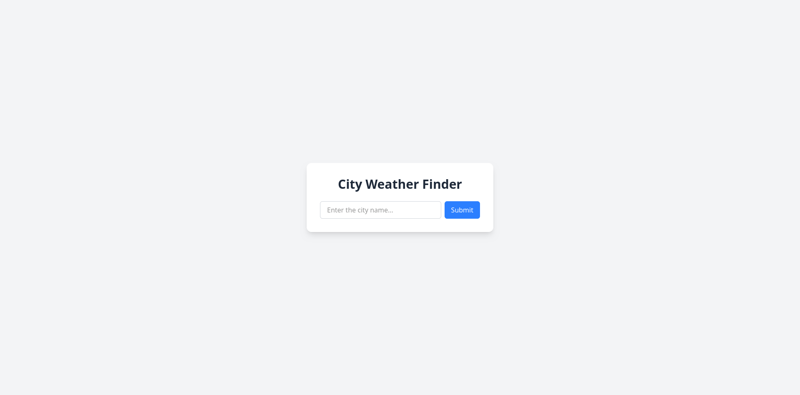
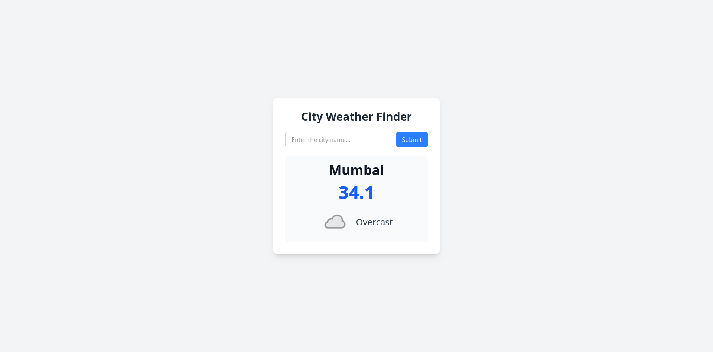

# Weather App (Laravel)

This is a simple Laravel web application that displays the current temperature and weather conditions for a specified city. The application fetches real-time weather data using the WeatherAPI.

## Features
- Get real-time weather updates
- Display temperature and weather conditions
- Search for any city
- Simple and clean UI

## Tech Stack
- Laravel
- Tailwind CSS (for UI)
- WeatherAPI (for fetching weather data)

## Installation

### Prerequisites
Make sure you have the following installed:
- PHP (>=8.0)
- Composer
- Laravel

### Steps
1. **Clone the Repository**
   ```sh
   git clone https://github.com/Shaunm1724/weather-app.git
   cd weather-app
   ```

2. **Install Dependencies**
   ```sh
   composer install
   ```

3. **Set Up Environment**
   - Copy the `.env.example` file and rename it to `.env`:
     ```sh
     cp .env.example .env
     ```
   - Generate an application key:
     ```sh
     php artisan key:generate
     ```
   - Set up your WeatherAPI key in the `.env` file:
     ```env
     WEATHER_API_KEY=your_api_key_here
     ```

4. **Run the Application**
   ```sh
   composer run dev
   ```
   The application will be accessible at `http://127.0.0.1:8000`.

## Usage
- Enter a city name in the search bar.
- The application will fetch and display the current temperature and weather conditions.

## API Configuration
This app uses [WeatherAPI](https://www.weatherapi.com/) to fetch weather data. Sign up on their website to get an API key and add it to your `.env` file.

## Screenshots

Here are some screenshots of the Weather App in action:

### Home Page
Displays the search bar where users can enter a city name.



### Weather Display
Shows the current temperature, weather condition, and an icon for the selected city.



<!-- 
## License
This project is licensed under the MIT License. -->

## Contributing
Pull requests are welcome! If you'd like to contribute, please open an issue first to discuss changes.

## Contact
For any inquiries, feel free to reach out via GitHub Issues.

